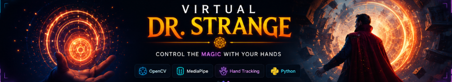

<div align="center">



<br>

# 🌀 Virtual Dr. Strange

### Control the Magic With Your Hands ✋✨

<p>
  
  
  
  
</p>

<p>
  <a href="#-about-the-project">About</a> •
  <a href="#-features">Features</a> •
  <a href="#-demo">Demo</a> •
  <a href="#-quick-start">Quick Start</a> •
  <a href="#-hand-gestures">Gestures</a>
</p>

</div>

---

## 🔮 About the Project

**Virtual Dr. Strange** is a Python-based computer-vision project that transforms your webcam into a magical interactive interface.

Using **real-time hand tracking and gesture recognition**, you can control visual effects, cast virtual spells, trigger magical portals, and interact with the application using nothing but your hands.

> ✋ **Your hands become the controller.**  
> 🌀 **Your gestures control the magic.**

---

## ✨ Features

<table>
<tr>

<td width="20%" align="center">

### 🖐️

**Real-Time Hand Tracking**

Detects and tracks hand landmarks in real time using MediaPipe.

</td>

<td width="20%" align="center">

### 🔥

**Gesture-Based Spell Casting**

Recognizes hand gestures and maps them to different magical actions.

</td>

<td width="20%" align="center">

### 🌀

**Magical Portal Effects**

Creates immersive portal and energy effects using OpenCV.

</td>

<td width="20%" align="center">

### ✨

**Interactive Visuals**

Combines computer vision with dynamic visual effects for an interactive experience.

</td>

<td width="20%" align="center">

### 🔊

**Voice Feedback**

Provides audio feedback for selected actions and commands.

</td>

</tr>
</table>

---

## 🎥 Demo

<div align="center">


<br><br>

**Real-time hand tracking + magical portal interaction**

</div>

---

## 🛠️ Tech Stack

<div align="center">

| Technology | Purpose |
|---|---|
| 🐍 **Python** | Core programming language |
| 👁️ **OpenCV** | Computer vision & visual effects |
| ✋ **MediaPipe** | Real-time hand tracking |
| 🔢 **NumPy** | Image and numerical processing |
| 🔊 **Pyttsx3** | Voice feedback |
| 🎥 **Webcam** | Real-time input |

</div>

---

## 🖐️ Hand Gestures

Different gestures are used to interact with the virtual environment.

<table>
<tr>
<th>Gesture</th>
<th>Action</th>
<th>Description</th>
</tr>

<tr>
<td align="center">🖐️ <b>Open Palm</b></td>
<td>Start / Activate</td>
<td>Activates the magical interaction.</td>
</tr>

<tr>
<td align="center">✊ <b>Fist</b></td>
<td>Cast Spell</td>
<td>Triggers a magical spell effect.</td>
</tr>

<tr>
<td align="center">✌️ <b>Two Fingers</b></td>
<td>Special Action</td>
<td>Triggers a special visual effect.</td>
</tr>

<tr>
<td align="center">👍 <b>Thumbs Up</b></td>
<td>Positive Action</td>
<td>Triggers the corresponding interaction.</td>
</tr>

<tr>
<td align="center">👎 <b>Thumbs Down</b></td>
<td>Negative Action</td>
<td>Triggers the corresponding interaction.</td>
</tr>

<tr>
<td align="center">👌 <b>OK Sign</b></td>
<td>Exit / Stop</td>
<td>Used to stop or exit the interaction.</td>
</tr>

</table>

---

## ⚡ Quick Start

### 1️⃣ Clone the Repository

```bash
git clone https://github.com/Deepak1Gautam/Virtual-Dr-Strange.git
